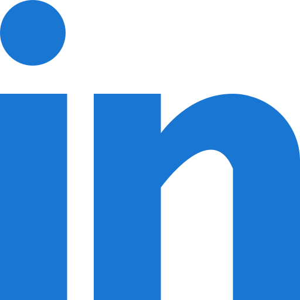

<!-- Replace the image link below with your own custom banner if you have one -->
<!-- 

  

 -->

## About me

- **Senior Computer Science Student** @ [IIIT Hyderabad](https://www.iiit.ac.in).
- **Undergraduate Researcher** at [Machine Learning Lab](https://www.linkedin.com/company/mll-iiith/) @ IIIT-H
- **Interests**: Reinforcement Learning • Software Development • Distributed Systems • Applied Machine Learning

Hi, I am Archisha, an Undergraduate Student pursuing Computer Science at IIIT-H. From digging deep into intricate problem-solving to creating innovative solutions, I'm fueled by curiosity and a drive to make a tangible impact. As a dedicated student of computer science, I've delved into web development, algorithms, software systems, artificial intelligence and machine learning. Each project and course has shaped my understanding and fueled my desire for knowledge. I am actively looking for opportunities that align with my interests and contribute to my growth to empower me in this exciting journey.

## Technical skills

### Programming Languages

### Frameworks & Libraries

### Tools & Platforms

## Connect with me

&nbsp;

&nbsp;

&nbsp;
&nbsp;

  
  
  

  <em>Always happy to collaborate!</em>

